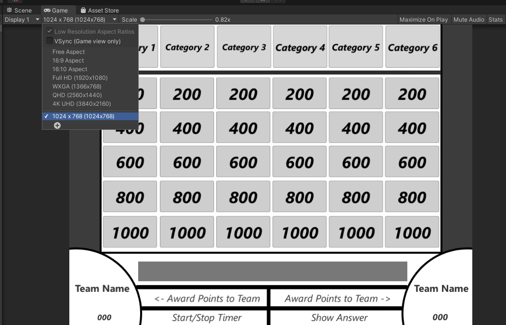

# Unity-Music-Trivia-Board

This repo contains the editor and project config for a Unity template object, you will need to download and install Unity and open the project to use it. I used Unity 2020.3.11 but most modern LTS versions should be fine. 

Download Unity [here](https://unity.com/download)
And some general guides on using the Unity editor: [Manual](https://docs.unity3d.com/Manual/SceneViewNavigation.html) | [Tutorial](https://learn.unity.com/tutorial/explore-the-unity-editor-1#)

## Instructions:

On this page, right next to the about section and above the number of commits; you should see a green button labeled: 'Code'. 
Click on that and download the zip of this repo. Once downloaded make an extra root folder(new folder for the zip extraction) and extract it. 

From there you can open the project in two ways:
- If the unity hub came with your install;
  - Go into the 'projects' tab and hit 'add'. Then select the project folder inside the root. 
- If you just have an install of Unity
  - Select the project from it's startup or inside the editor; go to File > Open Project.
  

When opening it for the first time you'll need to wait a minute or two as Unity needs to rebuild it's libraries, since they regen anyway and take too much space on the repo (akin to node modules). 

Once the project opens you will see a blank scene and a warning about the meta files. Disregard the warning, and navigate to the scenes folder in pane below the scene window. Title and Board are the two scenes used in this project, double click on board to get started with filling our your custom board selection. 

**When you open up the scene you may not see anything because the scene preview isn't focused on the UI (UI elements are scaled to the camera in game, but not in the scene)**

On the left of the preview is the hierarchy tab, click on the canvas object and then hover over the preview and press the F key. the camera should zoom out and center it's focus on the board. 

**Something else you need to do is to the game tab and set the game output prview to be what it's set in the final build. Also; click the 'Maximise on play' button across from it.**

With that you're ready to edit the board as much as you like, note that for Unity beginners you have to go back to the scene preview or click an object in the heirarchy to edit it's properties (found on the right, labeled as components). 

When importing music and video for the answers, I recommend putting them into their respective folders in the assets tab.
Once those are imported below are the objects that hold references to those assets and how the buttons are set up when it comes to their asset index:

Starting at 0 from the top most question going down to the bottom and over a column, remember; the element # corresponds to this.

Finally when you're finished go to File > Build settings and click Build. It'll prompt a location for the final unity build folder the contains the exe. 

